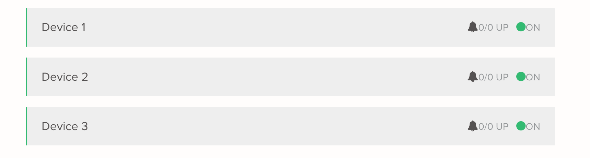

# React code challenge.

Thank you for applying to Hivelocity.  This repo contains the basics for you code challenge. To do this challenge
please:
 
1. fork this repository.
2. code up the design in the *challenge* section below
3. open a PR back to the original branch
4. send an email to the hiring manager that you have completed the challenge.

Please set aside ~1 hour to complete the challenge.

## Getting Started

In the project directory, run:

1. `npm install`
2. `npm start`

The second command runs the app in the development mode. 
Open [http://localhost:3000](http://localhost:3000) to view it in the browser.

The page will reload if you make edits. 

You should get a blank page with the words *Hello from Hivelocity* in the upper left corner.

If you are having trouble setting up the project, please email your hiring manager

## Challenge
The challenge is to request a list of devices from our API endpoint https://core.hivelocity.net/api/v2/device then render each individual device's data into components that look like this:

To see example data [interactive api docs are located here.](https://api-docs.hivelocity.net/openapi)

### Making the API Request

You should have received an API Key in the code challenge email that linked to this project.  That api-key is to be used to authenticate requests. Requests need to be made with the header `X-API-KEY` set to the api key in your email. If needed, more info on authentication is [located in the docs.](https://api-docs.hivelocity.net/authentication)

### NPM Packages

At Hivelocity we use [styled-components](https://www.npmjs.com/package/styled-components) for styling and [swagger-client](https://www.npmjs.com/package/swagger-client) for requests to the v2 API. They are already installed in this project. 

That said, do not feel obligated to use them, you are free to use whatever means of making requests and css styling you want. Feel free to install npm packages as necessary.

## Troubleshooting

We respect your time, and want to ensure that the code challenge takes as little of it as possible.  If you run into issues getting the project working, or with communication to the API, please email your hiring manager.  It is better to let us solve the issue than for you to use your personal time. 

# GOOD LUCK!
